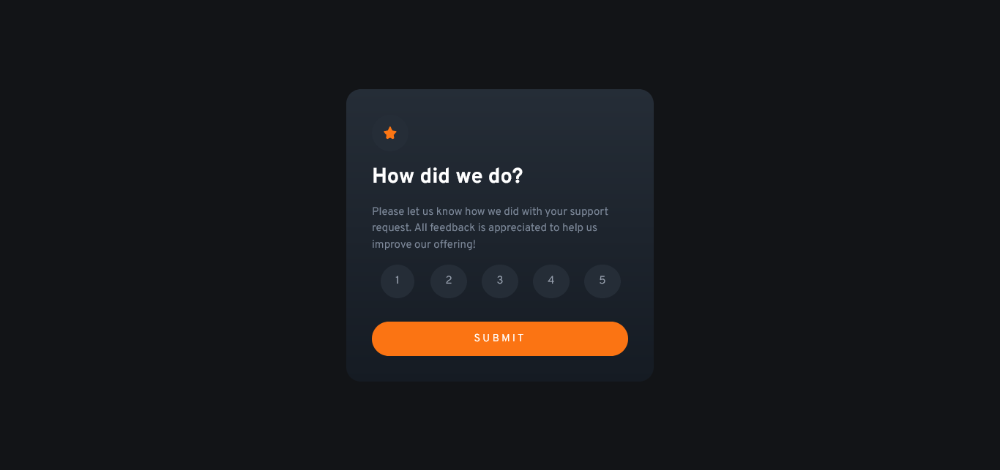

# Frontend Mentor - Interactive rating component solution

This is a solution to the [Interactive rating component challenge on Frontend Mentor](https://www.frontendmentor.io/challenges/interactive-rating-component-koxpeBUmI).

## Table of contents

- [Overview](#overview)
  - [The challenge](#the-challenge)
  - [Screenshot](#screenshot)
  - [Links](#links)
- [My process](#my-process)
  - [Built with](#built-with)
  - [What I learned](#what-i-learned)
  - [Useful resources](#useful-resources)
- [Author](#author)

## Overview

### The challenge

Users should be able to:

- View the optimal layout for the app depending on their device's screen size
- See hover states for all interactive elements on the page
- Select and submit a number rating
- See the "Thank you" card state after submitting a rating

### Screenshot



### Links

- Live Site URL: [https://lucasepk.github.io/interactive-rating-component/](https://lucasepk.github.io/interactive-rating-component/)

## My process

### Built with

- Semantic HTML5 markup
- CSS
- Flexbox
- CSS Grid
- Mobile-first workflow

### What I learned

About HTML I learnt the fieldset element and radio buttons

```html
<form>
  <fieldset>
    
    <input class="button_input" type="radio" id="n1" name="rating" value="1">
    <label class="button_label" for="n1">1</label>

    <input class="button_input" type="radio" id="n2" name="rating" value="2">
    <label class="button_label" for="n2">2</label>

    <input class="button_input" type="radio" id="n3" name="rating" value="3">
    <label class="button_label" for="n3">3</label>

    <input class="button_input" type="radio" id="n4" name="rating" value="4">
    <label class="button_label" for="n4">4</label>
    
    <input class="button_input" type="radio" id="n5" name="rating" value="5">
    <label class="button_label" for="n5">5</label>
  
    <input class="submit_button" type="submit" value="SUBMIT" onclick="submit_validation(document.querySelector('input[name=\'rating\']:checked'))">

  </fieldset>
</form>
```

About CSS I learnt how to style radio buttons and about CSS combinators
```css
.button_input{
    /*This hides radio default button*/
    display: none;
}

.button_input:checked + .button_label{
    /*this makes the selected radio button gray*/
    background-color: hsl(217, 12%, 63%);/*Light Grey*/
    color: hsl(0, 0%, 100%);/*white*/
}

.button_label{
    justify-self: center;

    background-color: hsl(213, 19%, 18%);/*dark blue*/
    color: hsl(217, 12%, 63%); /*Light Grey*/
    font-size: 0.9375rem;/*15px*/
    border-radius: 50%;
    padding: 10px 18px;

    border: none;
    cursor: pointer;

    display: block;
}
```

About js I learnt how to change the html and css and using radio buttons values
```js
function submit_validation(button_pressed) {
    // button pressed is document.querySelector('input[name="rating"]:checked');

    event.preventDefault()

    if (button_pressed != null) {
        //code for when a rating was pressed
        document.querySelector('.rating_card').style.display = "none";
        document.querySelector('.thank_u_card').style.display = "flex";
        document.querySelector('.orange_txt').innerHTML = "You selected "+button_pressed.value+" out of 5";
    } else {
        //code for when a rating wasn't pressed
        alert('No rating pressed');
    }
}
```

### Useful resources

- [https://www.youtube.com/watch?v=GDh9uToZkYg](https://www.youtube.com/watch?v=GDh9uToZkYg) - This video is really helpful to learn how to style radio inputs
- [https://stackoverflow.com/questions/10782054/what-does-the-tilde-squiggle-twiddle-css-selector-mean](https://stackoverflow.com/questions/10782054/what-does-the-tilde-squiggle-twiddle-css-selector-mean) - This has some info about CSS combinators
- [https://www.w3schools.com/js/js_htmldom_html.asp](https://www.w3schools.com/js/js_htmldom_html.asp) - good info about how to change html with js
- [https://www.w3schools.com/tags/tag_fieldset.asp](https://www.w3schools.com/tags/tag_fieldset.asp) - info about html fieldset tag
- [https://stackoverflow.com/questions/15839169/how-to-get-the-value-of-a-selected-radio-button](https://stackoverflow.com/questions/15839169/how-to-get-the-value-of-a-selected-radio-button) - how to get value of radio button in js
- [https://fedmentor.dev/posts/selectors-in-js/](https://fedmentor.dev/posts/selectors-in-js/) - how to select a html element in js

## Author

- Frontend Mentor - [@LucasEPK](https://www.frontendmentor.io/profile/LucasEPK)
